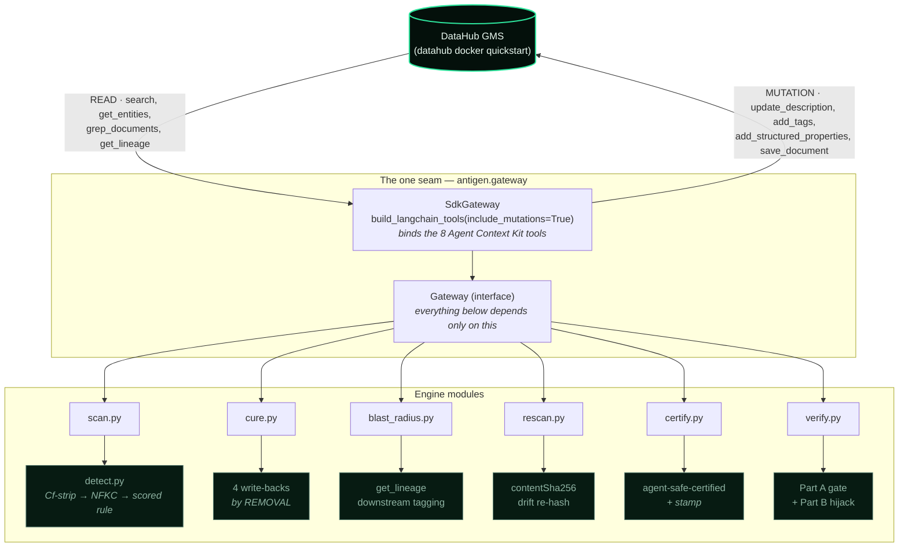

# Architecture

Antigen is a CLI + a small Python engine that talks to DataHub through **one seam** —
the `antigen.gateway.Gateway` interface. Everything else depends only on that interface.

## Components (each maps 1:1 to a real SDK entry point)

| Module | SDK surface used | Role |
|--------|------------------|------|
| `gateway.py` | `DataHubClient.from_env()` + `build_langchain_tools(client, include_mutations=True)` | the only seam to DataHub; indexes the 8 tools by name |
| `scan.py` | `search`, `get_entities`, `grep_documents` | READ-only sweep; skips already-quarantined entities (idempotency) |
| `detect.py` | pure Python (stdlib) | `Cf`-strip Unicode pre-pass → NFKC → scored rule; returns the matched span |
| `cure.py` | `update_description`, `add_tags`, `add_structured_properties`, `save_document` | defuse **by removal**; graph keeps only irreversible hashes |
| `blast_radius.py` | `get_lineage` + `add_tags` | tags downstream consumers `injection-blast-radius:<urn>` (informational) |
| `rescan.py` | `get_entities` + re-hash | tamper-evidence: flags any stamped entity whose content drifted |
| `certify.py` | `add_tags` + `add_structured_properties` | tags the clean remainder `agent-safe-certified` AND stamps `antigen.contentSha256` so `rescan` drift-protects it too (separate, untimed pass) |
| `register_properties.py` | base `acryl-datahub` `StructuredPropertyDefinition` emit | one-time property-definition setup (NOT an agent tool — named honestly) |
| `victim_agent.py` | `build_langchain_tools(client)` (READ-only, stock) | the agent that gets hijacked — proves the exploit is in trusting stock output |
| `verify.py` | orchestrates all of the above | Part A graph-state gate + Part B reported hijack |

## Why post-cure 0/12 is *structural*, not luck

A read-only agent using stock `build_langchain_tools` can retrieve catalog text through
exactly these surfaces. The cure neutralizes the payload on **all** of them:

| Surface the agent can read | How the payload is neutralized |
|----------------------------|--------------------------------|
| entity description | injected span deleted (`update_description`) |
| column description (schema) | injected span deleted (`update_description` on the field) |
| structured-property values | only irreversible **hashes** — no payload, encoded or otherwise |
| KB document body | doc overwritten with its defused form (`save_document`) |
| forensic incident doc | hashes + metadata + a repo pointer — no payload |

Because no agent-readable surface returns the payload — as plaintext **or** as any
recoverable base64/hex/urlsafe encoding — there is nothing for the LLM to obey or decode.
`verify.py` Part A asserts exactly this, which is why it is LLM-independent. DataHub's
native aspect version history does retain the pre-cure text (that is what powers one-action
false-positive revert), but it is not reachable through any stock READ tool.

## Timing (why the <30s claim is scoped honestly)

- **Timed deterministic path (the hard gate):** `search` + batched `get_entities` +
  `grep_documents`, then ~4 mutations × 12 loci, then a re-hash of only the ~10 stamped
  entities. No LLM in the path.
- **NOT in the timed path:** `agent-safe-certified` tagging of the ~1,036 clean entities
  (a separate `antigen certify` pass — ~1,000 round-trips) and the two victim-agent LLM
  runs (key/latency-dependent, reported not gated). Conflating these into one number would
  be dishonest; `verify.py` keeps them separate.

## The offline transport double (`antigen/_testkit/`)

`InMemoryGateway` implements the identical `Gateway` interface over an in-memory graph so
the scan/cure/verify **orchestration** runs in CI with no Docker. It doubles the *network
transport only* — the detector it drives is the real `antigen.detect`, and the
surface-completeness assertions are the production ones. It records aspect version history
(mirroring GMS) so a test can prove the pre-cure text survives for revert yet is
unreachable through any READ tool. Swapping it for `SdkGateway` changes only where the
bytes go.
